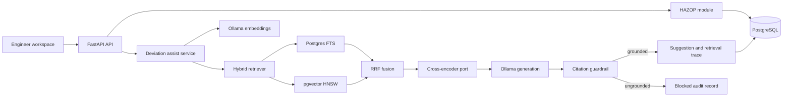

# PreventA Architecture

PreventA starts as a modular monolith. HAZOP, LOPA, SIL, corpus ingestion, and AI
assistance share one transactional boundary while keeping explicit module contracts.
Services can be split later only when deployment or scaling data justifies it.

## Module boundaries

- `api`: transport and dependency wiring only.
- `features/rag`: retrieval, fusion, reranking contracts, prompts, grounding, and orchestration.
- `features/opha`: OpenPHA (`.opha`) interoperability — lossless parse (`model.py`),
  typed ORM mapping (`orm_mapping.py`), reverse export (`export.py`), risk-matrix
  resolution (`risk.py`), LOPA recompute (`lopa_check.py`), file-revision handling
  (`versioning.py`).
- `features/workspace`: the running app's flat MVP store plus the `.opha` importer
  that flattens a study one row per consequence for the live worksheet.
- `db/models/hazop.py`: the OpenPHA-aligned risk tree — Study → Node → Deviation →
  Cause → Consequence, with structured Safeguards (IPL/SIL, m2m), a per-Consequence
  LOPA layer (+ itemised modifiers), Recommendations (m2m) and a configurable risk
  matrix. Consequence risk is tracked in three states (before / current / after recs).
- `db/models/registers.py`: OpenPHA supporting registers — team, sessions (+attendance),
  drawings, parking lot, MOC, SCAI, incidents, checklists; each keeps a raw JSON
  snapshot for lossless re-export.
- `db/models/rag.py`: corpus, suggestion, and evidence lineage.
- `core`: configuration, logging, and database lifecycle.

## OpenPHA interoperability

PreventA reads and writes the OpenPHA `.opha` JSON study format so real client
studies can be imported and edited studies exported as client-ready deliverables.

1. `load_opha` wraps the raw document in a lossless typed view (`OphaStudy`).
2. `to_orm` projects it onto the ORM tree; severity/likelihood codes are resolved
   into ordinals through the study's `Risk_Criteria`, and the LOPA arithmetic is
   recomputed and checked against the target (TMEL) on import.
3. `persist_opha_study` writes the graph to Postgres; `export_opha_study` +
   `orm_to_opha` rebuild a faithful `.opha` document back from the database — the
   round-trip proven by `import → database → export → compare` tests.
4. The file's data-structure revision (`Settings.Ds_Rev`) is recorded and checked
   so a newer/older OpenPHA layout fails loudly instead of importing silently wrong.

## Safety invariants

1. The model drafts; it never approves a HAZOP row or assigns SIL.
2. Every displayed candidate has at least one citation.
3. Every citation must point to a chunk from the request's retrieved context.
4. Blocked generations are still persisted for audit and evaluation.
5. Engineer acceptance, editing, and rejection are separate workflow states.
6. Standards content must preserve version and section references.

## Retrieval lifecycle

1. Build a query from equipment type, design intent, parameter, guideword, and deviation.
2. Run dense cosine search and PostgreSQL full-text search independently.
3. Fuse rankings with reciprocal rank fusion.
4. Pass candidates through the `Reranker` port.
5. Generate structured JSON from local Ollama.
6. Enforce citation membership before returning the response.
7. Persist ranks, scores, citation use, prompt version, model, and review outcome.

## Planned extensions

- Corpus ingestion workers with document checksum, chunking policy, and re-embedding jobs.
- A `bge-reranker` HTTP adapter implementing the existing `Reranker` protocol.
- LOPA IPL qualification and PFD range rules as deterministic policy checks first,
  with RAG used for cited explanations.
- Study-level audit rules for missing safeguards and target-versus-achieved SIL.
- Tenant and row-level security before multi-customer deployment.

