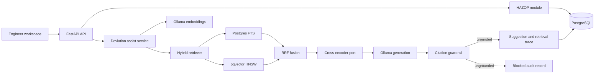

# PreventA Architecture

PreventA starts as a modular monolith. HAZOP, LOPA, SIL, corpus ingestion, and AI
assistance share one transactional boundary while keeping explicit module contracts.
Services can be split later only when deployment or scaling data justifies it.

## Module boundaries

- `api`: transport and dependency wiring only.
- `features/rag`: retrieval, fusion, reranking contracts, prompts, grounding, and orchestration.
- `db/models/hazop.py`: study, node, and worksheet state.
- `db/models/rag.py`: corpus, suggestion, and evidence lineage.
- `core`: configuration, logging, and database lifecycle.

## Safety invariants

1. The model drafts; it never approves a HAZOP row or assigns SIL.
2. Every displayed candidate has at least one citation.
3. Every citation must point to a chunk from the request's retrieved context.
4. Blocked generations are still persisted for audit and evaluation.
5. Engineer acceptance, editing, and rejection are separate workflow states.
6. Standards content must preserve version and section references.

## Retrieval lifecycle

1. Build a query from equipment type, design intent, parameter, guideword, and deviation.
2. Run dense cosine search and PostgreSQL full-text search independently.
3. Fuse rankings with reciprocal rank fusion.
4. Pass candidates through the `Reranker` port.
5. Generate structured JSON from local Ollama.
6. Enforce citation membership before returning the response.
7. Persist ranks, scores, citation use, prompt version, model, and review outcome.

## Planned extensions

- Corpus ingestion workers with document checksum, chunking policy, and re-embedding jobs.
- A `bge-reranker` HTTP adapter implementing the existing `Reranker` protocol.
- LOPA IPL qualification and PFD range rules as deterministic policy checks first,
  with RAG used for cited explanations.
- Study-level audit rules for missing safeguards and target-versus-achieved SIL.
- Tenant and row-level security before multi-customer deployment.

